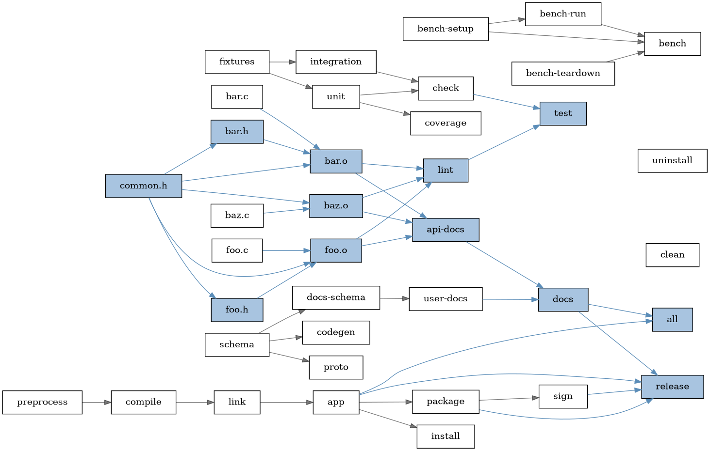
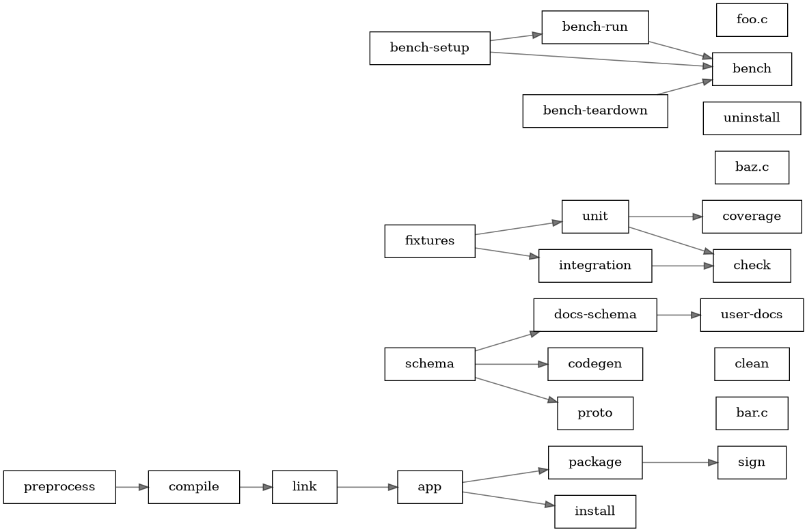

# Make Lineage

A Lean 4 command-line tool that converts GNU Make's auto-generated database into Graphviz DOT format, with support for pruning and highlighting dependency lineage.

## Overview

`make_lineage` parses the output of `make -n -p` (Make's printed database) and produces a DOT graph of target dependencies. It then offers three lineage operations relative to a given target:

| Operation | Flag | Description |
|---|---|---|
| **Highlight** | `--highlight-lineage <target>` | Full graph is emitted; the lineage of `<target>` is highlighted |
| **Keep** | `--keep-lineage <target>` | Only the lineage of `<target>` is emitted; all unrelated nodes are removed |
| **Prune** | `--prune-lineage <target>` | The lineage of `<target>` is removed; everything else is kept |

## Requirements

- [Lean 4](https://lean-lang.org/) with [Lake](https://github.com/leanprover/lake) build system
- [Graphviz](https://graphviz.org/) (`dot` command)
- GNU Make

## Build

Binary is in `.lake/build/bin`.

```sh
lake build -Krelease
```

## Examples

### Highlight

Highlighting the lineage of `common.h`

```sh
LANG=C make -n -p -f res/Makefile | .lake/build/bin/ml --highlight-lineage common.h | dot -Tpng -o res/prune-common.png
```



### Keep

Keeping only the lineage of `common.h`

```sh
LANG=C make -n -p -f res/Makefile | .lake/build/bin/ml --keep-lineage common.h | dot -Tpng -o res/prune-common.png
```


### Prune

Pruning the lineage of `common.h`

```sh
LANG=C make -n -p -f res/Makefile | .lake/build/bin/ml --prune-lineage common.h | dot -Tpng -o res/prune-common.png
```



